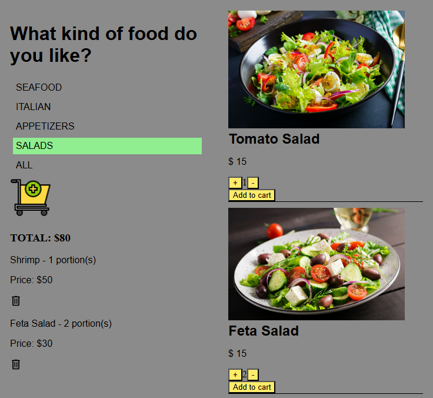

# Redux Food Order App

A single-page educational application built with React and Redux Toolkit. Users can browse meals by category, add multiple portions to the cart, and dynamically view total pricing.

  

## Features

- 🧾 Food menu categorized (Seafood, Italian, Salads, etc.)
- 🍝 Filter dishes by clicking on a category
- 🛒 Add any number of portions to the cart
- 📦 Real-time cart updates with:
  - Dish name
  - Quantity
  - Total price per item
  - Remove option for each dish
- 💰 Live total order price displayed
- ⚛️ State management with Redux Toolkit

## Built With  

## 🎯 Project Purpose  
This project is for educational purposes and showcases how to use Redux Toolkit in a real-world user interaction scenario.

## 📩 Contact  

If you have any questions or suggestions, feel free to reach out:  

📧 **Email**: [o.nova0804@gmail.com](mailto:o.nova0804@gmail.com)  
🔗 **LinkedIn**: [Oksana Smirnova](https://www.linkedin.com/in/oksana-smirnova-developer/)  